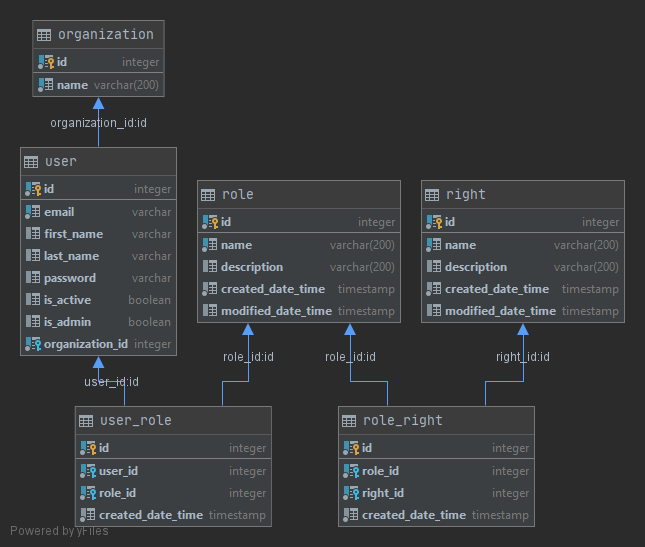

# 
# FastAPI - User management sample application
This is a backend API developed with FastAPI and deployed to Amazon ECS using Terraform.
Live demo: http://fastapi-users-dev-1041951890.us-east-2.elb.amazonaws.com
## Features
This API allows you to manage users that belong to organizations.
In addition, it also allows you to create roles that contain rights, which can be associated with users. 



In summary, it contains the following features: 
 - CRUD users
 - CRUD organizations
 - CRUD rights
 - CRUD roles
 - Associate roles with rights
 - Associate roles with users

## Tech
 * [FastAPI]: Web framework to build the API
 * [Typing]: Python type hints
 * [SQLAlchemy]: ORM toolkit
 * [Pydantic]: Data validation and settings management
 * [Serum]: Dependency injection
 * [Pytest]: Unit and integration tests + [Pytest-cov] for coverage check and report.
 * [Flask8]: Code linting
 * [PostgreSQL]: Relational DB located at [ElephantSQL]
 * [uvicorn-gunicorn-fastapi]: Base Docker image
 * [Terraform]: Infrastructure as code. This project also uses Terraform Cloud for remote execution (remote backend) 
 and for storing environment-specific variables (workspaces) 
 * [Github Actions]: CICD workflow. 
 * [Amazon ECS] + [Fargate]: Application infrastructure on AWS

#### Run the service locally
```sh
$ git clone https://github.com/epicatto/fastapi-user-app.git
$ cd fastapi-user-app
$ Docker build -t fastapi_users .
$ Docker-compose up -d
```

#### Terraform setup
We use Terraform to define and create the infrastructure required to run this API on Amazon ECS.
We set up a remote backend to store Terraform states in Terraform Cloud. 
Furthermore, we use workspaces to also store the environment-specific variables that terraform will use:
 * aws_access_key: AWS Access Key
 * aws_secret_key: AWS Secret Key
 * aws_account_id: AWS Account ID 
 * aws_region: AWS Region
 * ecr_name: AWS registry name
 * environment: Environment
 * app_name: Application name
 * app_db_schema: Application DB schema
 * app_db_server: Application DB server name
 * app_db_user: Application DB user
 * app_db_password: Application DB user password
 * app_db_name: Application DB name
 * app_db_port: Application DB port

#### CICD workflow
This project uses GitHub Actions to orchestrate the steps required to build and deploy the API. 
This workflow runs the following jobs on each push to `develop`/`master` or when a new pull request is created for `master` branch:
   * Build:
      1. Python setup
      2. Install project dependencies
      3. Run code linting with flake8
      4. Run unit and integration tests with pytest
   * Docker
      1. Build Docker image
      2. Push the Docker image to ECR with [aws-ecr-action] action
      3. Create/update a `*.auto.tfvars` file with the Docker image tag (GitHub execution hash). 
      (This is the way used fort terraform to know the image name to be used during deployment)
   * Terraform
      1. Remote terraform execution with [setup-terraform] action:
      init -> validate -> plan -> apply (only on push to `master`) 

This workflow needs some GitHub secrets to run:
 * AWS_ACCESS_KEY_ID: AWS Access Key (to push the Docker image to ECR)
 * AWS_SECRET_ACCESS_KEY: AWS Secret Key (to push the Docker image to ECR)
 * AWS_ACCOUNT_ID: AWS Account ID (to push the Docker image to ECR)
 * AWS_REGION: AWS Region (to push the Docker image to ECR)
 * ECR_NAME: Amazon ECR name (to push the Docker image to ECR)
 * TF_API_TOKEN: Terraform Cloud token (for remote Terraform execution)
 
 
## Pending improvements
 * Create a domain for the API
 * Create an SSL certificate and attach it to the domain
 * Create a new workspace on Terraform Cloud with 'prod' environment variables and update the CICD workflow to 
 select the corresponding workspace based on the branch.


[uvicorn-gunicorn-fastapi]: <https://github.com/tiangolo/uvicorn-gunicorn-fastapi-Docker>
[ElephantSQL]: <https://www.elephantsql.com/>
[FastAPI]: <https://fastapi.tiangolo.com/>
[SQLAlchemy]: <https://www.sqlalchemy.org/>
[Pydantic]: <https://github.com/samuelcolvin/pydantic>
[Serum]: <https://github.com/suned/serum>
[Pytest]: <https://docs.pytest.org/en/stable/>
[Pytest-cov]: <https://github.com/pytest-dev/pytest-cov>
[Flask8]: <https://gitlab.com/pycqa/flake8>
[PostgreSQL]: <https://www.postgresql.org/>
[Terraform]: <https://www.terraform.io/>
[Github Actions]: <https://docs.github.com/en/actions>
[Amazon ECS]: <https://aws.amazon.com/en/ecs/>
[Fargate]: <https://aws.amazon.com/en/fargate/>
[Typing]: <https://docs.python.org/3/library/typing.html>
[aws-ecr-action]: <https://github.com/kciter/aws-ecr-action>
[setup-terraform]: <https://github.com/hashicorp/setup-terraform>
